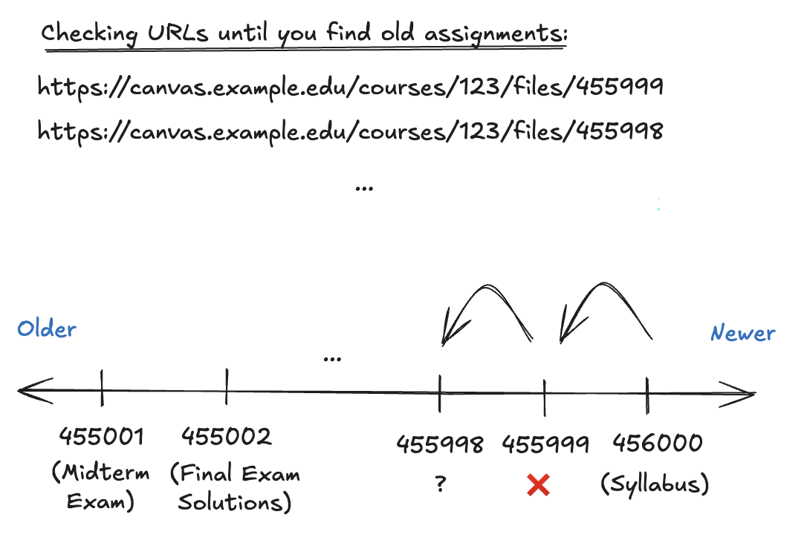
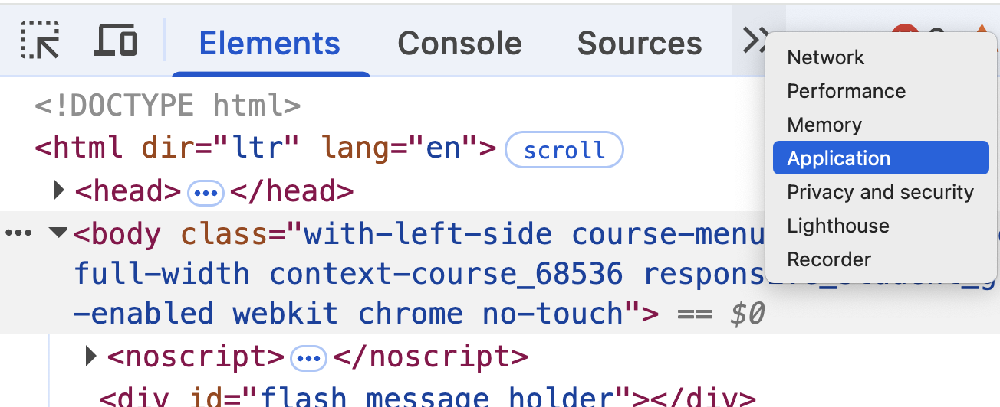
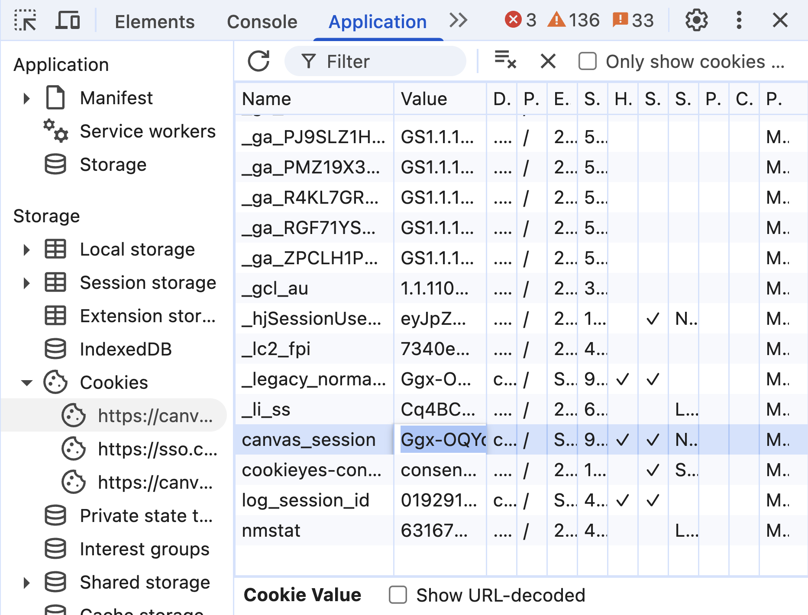

# Canvas File Explorer

A tool to explore a canvas course, and potentially find homework solutions and exams from previous semesters. **This does not work for every course.** This only works if a professor re-initializes a course that he/she has taught before.

**[ Video demo](https://youtu.be/7f0Lu8lJ3iI)**

**[ Discord Server for tech support](https://discord.gg/k7yNftGEAA)**

## Why does this work?

This script works because Canvas uses a sequential numbering system for file IDs. This is known as an **auto-incrementing primary key**. When a file is uploaded to Canvas, it is assigned a unique ID that is one greater than the previous file's ID. This means that the IDs are sequential and predictable. So if you know the ID of one file, you can easily find the IDs of other files by simply incrementing or decrementing the known ID.
As an example, consider this:

```
https://canvas.example.edu/courses/123/files/455000 // Homework 10 Solutions
https://canvas.example.edu/courses/123/files/455001 // Midterm Exam
https://canvas.example.edu/courses/123/files/455002 // Final Exam Solutions


https://canvas.example.edu/courses/123/files/456000 // Syllabus
```

If you have the location of the syllabus (`456000`), you can easily find the location of the other files by simply decrementing the file ID. This is what this script does. It starts at a given file ID and checks as many files as you want (specified by the `--num-files` flag) by decrementing the file ID.

Our goal is to find the old files when a professor re-initializes a course. If a professor re-initializes a course, the old file IDs will appear concentrated and in close proximity due to the sequential, auto-incrementing nature of the file IDs in the database.



## Prerequisites

- Install Python 3 ([Awesome Tutorial](https://realpython.com/installing-python/))
- Open a terminal (On macOS, press `Command + Space` and type `Terminal`. On Windows, press `Windows + R` and type `cmd`)
- Clone this repo and navigate to the directory where you cloned it. You can do this by running the following commands in your terminal:

```bash
git clone https://github.com/erict963/canvas-tool.git
cd canvas-tool
```

This script was built with only the standard library, so no additional packages are required! You should be able to run it without any additional installations.

## Usage

### Example

The following example command will start at `https://canvas.example.edu/courses/123/files/456000`
and search all the URLs from `456000` to `(456000 - 10000 = 446000)`.

Example command to paste into your terminal:

```
python3 canvas.py --canvas-session Ggx-OQY... \
 --url https://canvas.example.edu/courses/123/files/456000 \
 --num-files 10000 \
 --use-api
```

The `--use-api` flag is optional. It will use the Canvas API to get file names instead of the default method, which is to scrape the frontend page. The API method is faster, but it may not work for all files. See the Canvas API section on why this is the case.

So to be perfectly clear, the above command will check these URLs:

```
https://canvas.example.edu/api/v1/courses/123/files/456000
https://canvas.example.edu/api/v1/courses/123/files/455999
https://canvas.example.edu/api/v1/courses/123/files/455998
...
https://canvas.example.edu/api/v1/courses/123/files/446000
```

If you do not pass in the `--use-api` flag, it will resort to checking the frontend URLs instead. The URLs will look like this:

```
https://canvas.example.edu/courses/123/files/456000
https://canvas.example.edu/courses/123/files/455999
https://canvas.example.edu/courses/123/files/455998
...
https://canvas.example.edu/courses/123/files/446000
```

**Important:** The script assumes that the URL matches this ending pattern: `/files/{file_id}` where `{file_id}` is an integer.

### Full Command Line Options

To see all the command line options, you can run the following command:

```
python3 canvas.py -h
```

This will show you all the available options and their descriptions. Here is a summary of the options:

```
usage: canvas.py [-h] -u URL [-f NUM_FILES] [-s CANVAS_SESSION] [-w NUM_WORKERS]
                 [-l LOG_EVERY] [--use-api]

Canvas file sweeper

options:
  -h, --help            show this help message and exit
  -u, --url URL         The URL of the file to start from, e.g.
                        https://canvas.example.edu/courses/123/files/456
  -f, --num-files NUM_FILES
                        Number of files to scan (default 10000, min 1)
  -s, --canvas-session CANVAS_SESSION
                        The Canvas API canvas_session, provided as an environment
                        variable or command line argument. If not provided, the
                        script will use the CANVAS_SESSION environment variable.
  -w, --num-workers NUM_WORKERS
                        Number of threads to use (default 16, max 32)
  -l, --log-every LOG_EVERY
                        Log every (X) files found (default 1000, min 1)
  --use-api             Experimental: Use the Canvas API instead of the frontend
                        (default: False) - this will be faster but may not
                        necessarily find all files. See README for more details.
```

## Canvas session

The `canvas_session` is what allows this Python script to check for your Canvas files. It's like a password (hence why you **shouldn't share it with anyone**). Whenever you log into Canvas, this `canvas_session` is created and stored securely in your browser. Applications use tokens to authenticate users and authorize access to resources.

In short, it gives the script permissions to act on your behalf. Don't worry, all this script is doing is checking if your professor's files are available or not. See the code in `canvas.py` for more details, and feel free to ask ChatGPT if you think any lines are suspicious.

### Obtaining

To obtain a `canvas_session`, first make sure you're logged into your school's Canvas. Then, visit any page in Canvas. For example, go to

```
https://canvas.example.edu/courses/123/files/456
```

Then right-click on the page and select "Inspect". This will open the developer tools. In the developer tools, select the "Application" tab.



On the left side, you should see a list of items. Click on "Cookies" and then select your school's Canvas domain. You should see a list of cookies. Look for a cookie called `canvas_session`. Copy the value of this cookie.



### Using an environment variable

If you prefer to not repeatedly have to enter the `canvas_session` with the `--canvas-session` flag, you can certainly export it as an environment variable. This is done by running the following command in your terminal:

```bash
export CANVAS_SESSION=Ggx-OQY...
```

Now, you can run the script without the `--canvas-session` flag. The script will automatically use the `canvas_session` from the environment variable each time you run it.

```bash
python3 canvas.py --url https://canvas.example.edu/courses/123/files/456000 --num-files 10000 --use-api
```

## Canvas API

### Why use the API?

Great question! You're asking what's the difference between visiting this URL:

`https://canvas.example.edu/api/v1/courses/123/files/456000` versus this URL `https://canvas.example.edu/courses/123/files/45600`

Let's take a look at the api URL first. If you enter this `https://canvas.example.edu/api/v1/courses/123/files/456000` into your browser (just an example, but do try it with your courses!), you should see something like this (truncated for brevity):

```json
{
  "id": 123,
  "uuid": "tRuCMqv9QumS9OqBhXe2gPs0SdtUl4RHFcY5hdmo",
   ...
}
```

Now, let's take a look at the frontend URL. Simply delete the `api/v1/` part of the URL and enter it into your browser.
So the URL would look like this: `https://canvas.example.edu/courses/123/files/456000`, and the response would be something like this (truncated for brevity):

```html
<!DOCTYPE html>
<html dir="ltr" lang="en">
  <head>
    ...
  </head>
</html>
```

The main difference is the **size** of the responses. A typical example would be something like this: The API response is `300B` while the frontend response is `13kB`. This means the server will take longer to send the frontend response.

### Why does the API "miss" some files (not necessarily a bad thing) ?

I observed this "missing" behavior empirically, so this explanation is slightly speculative. Please let me know if you have a better explanation.

If you go to the [actual code of how Canvas is implemented](https://github.com/instructure/canvas-lms/blob/ddaaa0089cb3e83783056404d44106527dfe5ef1/app/models/attachment.rb#L1756)

You may see something like this:

```ruby
def destroy_content_and_replace(deleted_by_user = nil)
```

This means that when a professor re-initializes a course, the old files may start like this:

```
https://canvas.example.edu/courses/123/files/1 // Homework 10 Solutions
https://canvas.example.edu/courses/123/files/2 // Midterm Exam
https://canvas.example.edu/courses/123/files/3 // Final Exam Solutions
```

However, now let's say the professor makes a correction to Homework 10 Solutions before making them available to everyone. Because the content is destroyed but replaced with a new ID, and the fact that the IDs are sequential, the new file ID may look like this:

```
https://canvas.example.edu/courses/123/files/4 // Updated Homework 10 Solutions
```

So the API will no longer detect that the old file ID lives at `1`, but rather at `4`.

However, the frontend will still show the old file ID `1` as a valid file, and redirect to the new file ID `4` via the API.

This is why using this script to search via API may "miss" some files - the frontend relies on the API to report the correct data. Note, the frontend search will always "hit" every ID that exists.

This is not necessarily a bad thing, because our entire goal is to get the "old files" that aren't currently available to the public.

## Using the `--forward` flag

The `--forward` flag allows you to search for files in the forward direction. This means that instead of starting at a given file ID and decrementing, it will start at a given file ID and increment. Using the above example, if you start at `456000`, it will check the following URLs:

```
https://canvas.example.edu/api/v1/courses/123/files/456001
https://canvas.example.edu/api/v1/courses/123/files/456002
...
https://canvas.example.edu/api/v1/courses/123/files/466000 // Potential Final Exam that hasn't been released yet
```
